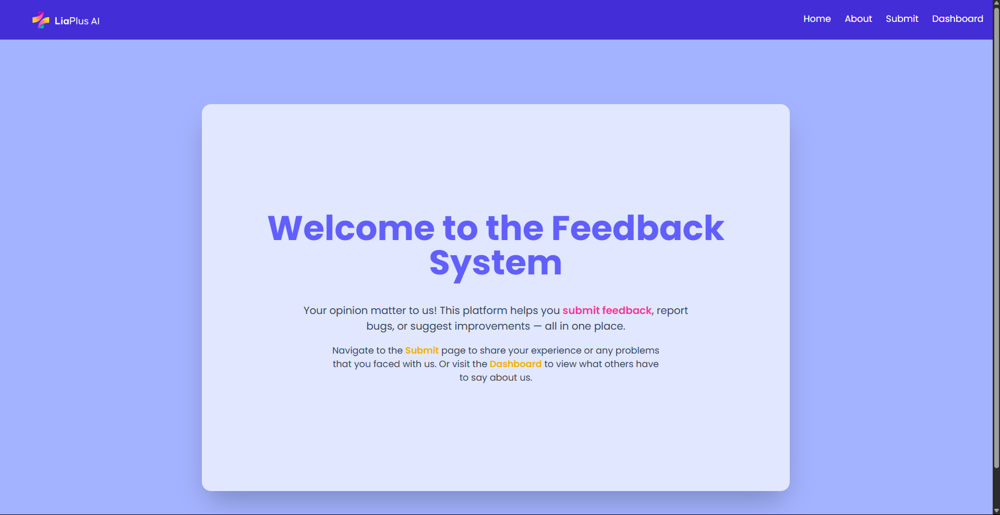
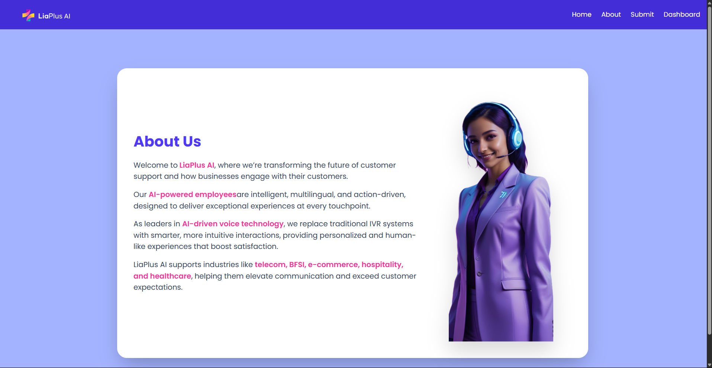
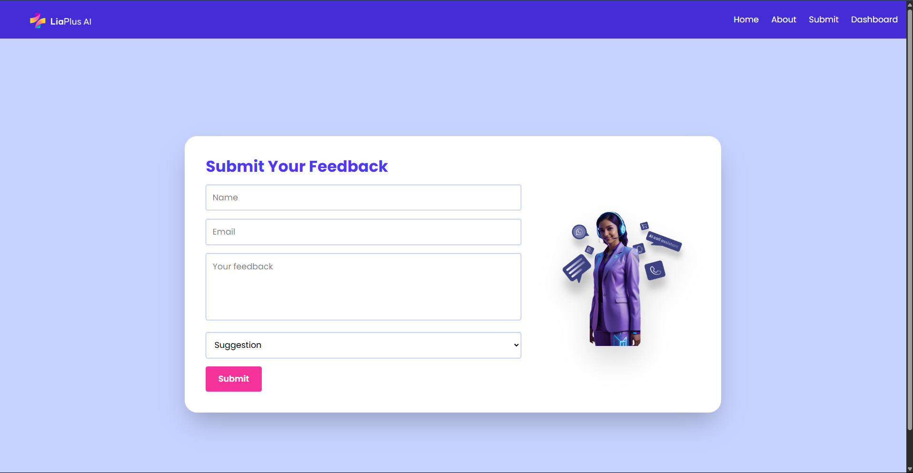
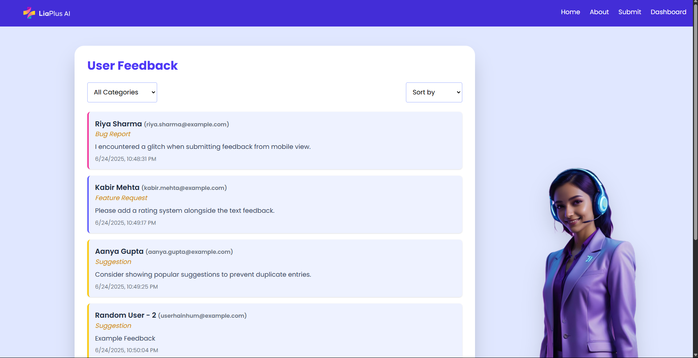

# LiaPlus - User Feedback System

## Table of Contents

- [LiaPlus - User Feedback System](#liaplus---user-feedback-system)
  - [Table of Contents](#table-of-contents)
  - [Introduction](#introduction)
  - [Features](#features)
  - [Tech Stack](#tech-stack)
  - [Project Structure](#project-structure)
    - [📦 Backend](#-backend)
    - [🎨 Frontend](#-frontend)
  - [Screenshots](#screenshots)
    - [🏠 Home Page](#-home-page)
    - [About Page](#about-page)
    - [📝 Feedback Form](#-feedback-form)
    - [📊 Feedback Dashboard](#-feedback-dashboard)
  - [Installation and Setup](#installation-and-setup)
    - [Backend](#backend)
    - [Frontend](#frontend)
  - [API Reference](#api-reference)
    - [Base URL](#base-url)
    - [Endpoints](#endpoints)
  - [Query Parameters](#query-parameters)
    - [🔍 Example Queries](#-example-queries)
  - [Environment Variables](#environment-variables)
  - [License](#license)

---

## Introduction

This is a **Full-Stack User Feedback System** created for **LiaPlus AI Assessment**. It allows users to submit feedback, and admins to view/filter/sort feedback based on type and time. Built using **ReactJS**, **Node.js**, **Express**, and **MongoDB**, styled with **TailwindCSS**, and structured with clean, modular architecture.

---

## Features

✅ Submit feedback through an intuitive form  
✅ Filter by category: _Suggestion_, _Bug Report_, _Feature Request_  
✅ Sort by date: _Newest First_, _Oldest First_  
✅ Responsive and accessible UI  
✅ Clean folder structure and maintainable code  
✅ Mascot support for friendly visuals 🧸  
✅ Future-ready: Easily extendable to support auth & deployment

---

## Tech Stack

| Frontend                                                                                                                                                                                                                                                                                                                    | Backend                                                                                                                                                                                                                | Database                                                                                                 | Styling                                                                                                               | Utilities                                                                                                                                                                                                                                                                                                         |
| --------------------------------------------------------------------------------------------------------------------------------------------------------------------------------------------------------------------------------------------------------------------------------------------------------------------------- | ---------------------------------------------------------------------------------------------------------------------------------------------------------------------------------------------------------------------- | -------------------------------------------------------------------------------------------------------- | --------------------------------------------------------------------------------------------------------------------- | ----------------------------------------------------------------------------------------------------------------------------------------------------------------------------------------------------------------------------------------------------------------------------------------------------------------- |
|    |   |  |  |    |

---

## Project Structure

### 📦 Backend

```markdown
backend/
├── controllers/
│ └── feedbackController.controller.js
├── models/
│ └── feedback.model.js
├── routes/
│ └── feedbackRoutes.routes.js
├── database/
│ └── db.js
├── .env
├── package.json
└── server.js
```

### 🎨 Frontend

```markdown
frontend/
├── public/
├── src/
│ ├── assets/
│ ├── components/
│ │ └── Navigation/
│ │ └── Navbar.jsx
│ ├── pages/
│ │ ├── Home.jsx
│ │ ├── About.jsx
│ │ ├── FeedbackForm.jsx
│ │ └── FeedbackPage.jsx
│ └── App.jsx
├── tailwind.config.js
└── package.json
```

---

## Screenshots

### 🏠 Home Page



### About Page



### 📝 Feedback Form



### 📊 Feedback Dashboard



---

## Installation and Setup

### Backend

```bash
cd backend
npm install
npm run dev    # or: node server.js
```

### Frontend

```bash
cd frontend
npm install
npm run dev
```

> Make sure both `frontend` and `backend` are running concurrently on different ports (default: 5173 + 5000)

---

## API Reference

### Base URL

```postman
http://localhost:5000/api/v1/feedback
```

### Endpoints

| Method | Endpoint    | Description            |
| ------ | ----------- | ---------------------- |
| POST   | `/feedback` | Submit feedback        |
| GET    | `/feedback` | Retrieve all feedbacks |

---

## Query Parameters

| Parameter  | Type   | Example         | Description                  |
| ---------- | ------ | --------------- | ---------------------------- |
| `category` | string | `Bug Report`    | Filter by category           |
| `sort`     | string | `asc` or `desc` | Sort by date (oldest/newest) |

### 🔍 Example Queries

- Get all feedbacks:
  `GET /api/v1/feedback`

- Only suggestions:
  `GET /api/v1/feedback?category=Suggestion`

- Sorted by oldest:
  `GET /api/v1/feedback?sort=asc`

- Bug reports sorted by newest:
  `GET /api/v1/feedback?category=Bug%20Report&sort=desc`

---

## Environment Variables

Create a `.env` file in the backend root with the following:

```env
PORT=5000
MONGODB_USERNAME=<your_mongo_username>
MONGODB_PASSWORD=<your_mongo_password>
MONGODB_URI=<your_complete_mongodb_uri>
```

> 🔐 Ensure `.env` is included in `.gitignore`

---

## License

This project is licensed for academic or assessment use. For commercial inquiries, contact the author.

---
